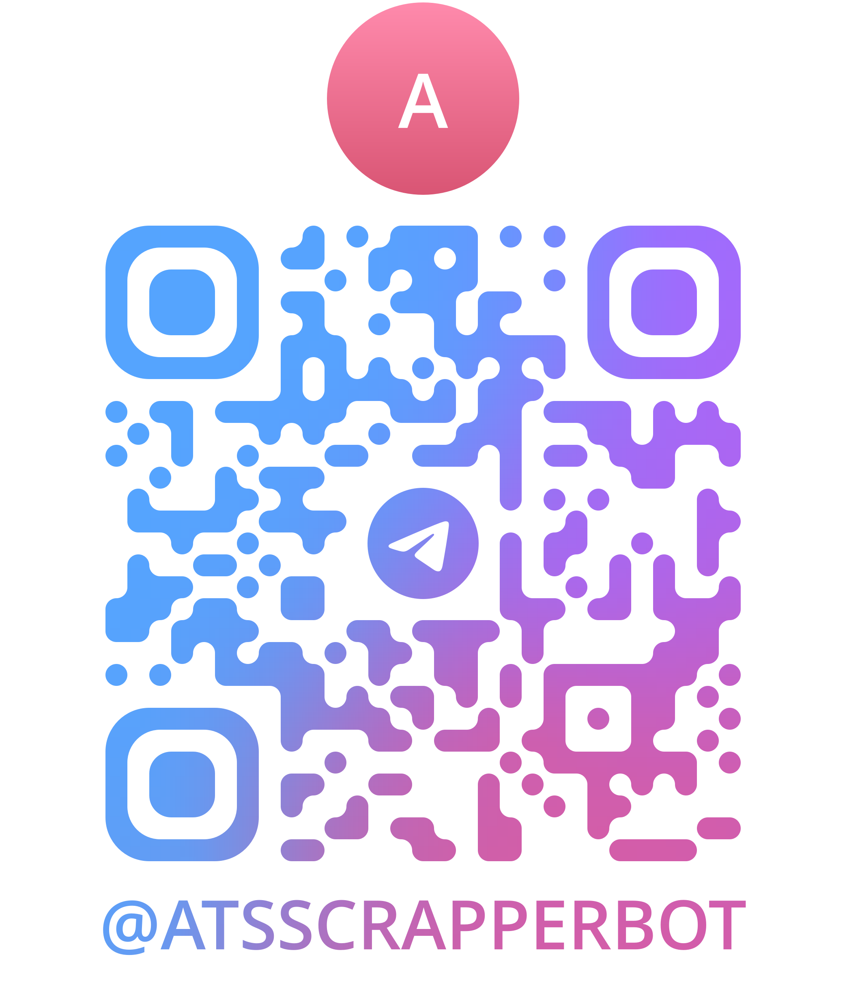
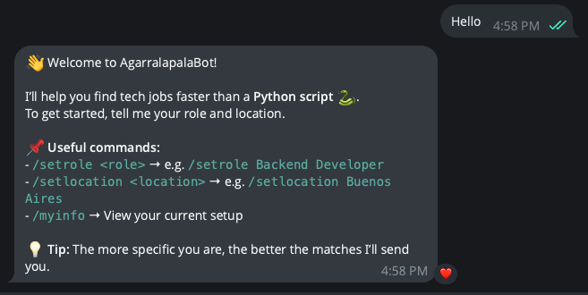
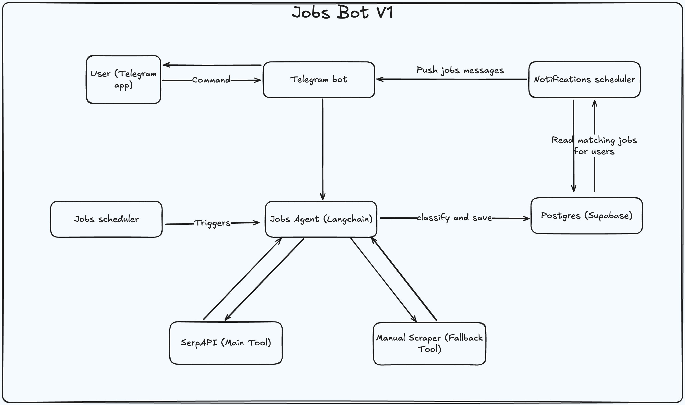

# AgarralapalaBot
A langchain-based agent that uses scrapping tools for looking for jobs and exposes a telegram chatbot with periodical updates.

<div align="center">
    
</div>

# Setting up development environment
```bash
# Copy the .env example file and replace with actual values
cp .env.example .env

# Create a venv and install dependencies
make setup

# Start the telegram bot and agents schedulers
make serve
```

Then, go to Telegram app and chat @AgarralapalaBot or scan the QR below:

<div align="center">
    
</div>

## Example message
<div align="center">
    
</div>

# New Features (v2.0)

## Job Enrichment with Playwright
The system now automatically enriches job postings by fetching detailed descriptions from job URLs using Playwright. This provides:
- Detailed job descriptions
- Requirements and qualifications
- Benefits and perks
- Salary information
- Contact details

## LangGraph Workflow Orchestration
A new workflow system using LangGraph orchestrates the complete job matching process:
1. **Job Fetching**: Original job seeker agent fetches job postings
2. **Job Enrichment**: Playwright enriches job postings with detailed information
3. **Candidate Matching**: Enhanced matching with enriched job data

## Automated Notifications
The system now automatically sends notifications to candidates about new job matches:
- Runs every 6 hours
- Sends personalized notifications via Telegram
- Includes match scores and job details
- Groups multiple matches for efficiency

## Scheduled Processing
Two separate cron jobs manage the workflow:
- **Daily Job Enrichment**: Runs the complete workflow once per day
- **Notification System**: Sends match notifications every 6 hours

# Guides
* Database Migrations: [Read](docs/migrations.md)

# Technologies
* Python
* Langchain
* SerpAPI
* Scraping (hrequests)
* Supabase (Postgres provisioning)
* SQLAlchemy
* Alembic (Migrations system)
* OpenAI

# Architecture (Out-of-date diagram)
The system has a LangChain agent backed by OpenAI API, and uses SerpAPI and hrequests to perform scrapping over results.


# Features
For a given input of tech stacks and locations, it'll approach search from different sources:
** Google search (via SerpAPI, or hrequests when SerpAPI plan is out of credits); queries directly to ATS will be performed, example: `(ashby OR lever OR greenhouse) backend {location}`
** Will scrape YC's (jobs directory)[workatastartup.com] and look for job openings and save them, for those cases in which the company is not clear with the location, a second scrapping to company's linked-in page will be performed to determine if it has people working from the region the users are looking for
** The LLM will be in charge of classifying and standarizing those results into records that can be saved to the DB
** The LLM will match the scapped jobs to users knowing their role, stack and location
** The LLM is smart enough to group users by location, role, and stack. Example:
```
UserId | Role    | Stack          | Location
1      | backend | nodejs, python | argentina
2      | backend | python         | uruguay
3      | data    | python, pandas | chile
4      | backend | nodejs         | argentina
```
In this case, without grouping, one search per user could be performed, but instead of that, the system must group users so the searches are more token and cost efficient and results are better, so the queries would be:
* q1: `(ashby OR lever OR greenhouse) backend LATAM`
* q2: `(ashby OR lever OR greenhouse) data LATAM`
Then with the results, instead of asking again for results with each specific technology (node, python) ask the LLM to read the job postings and match tech stacks with them.

# Job standarization
For better handling, results must have this structure:
```json
{
  "id": autogenerated_stuff,
  "link": "http://someatslink.com/job",
  "company_name": "",
  "job_title": "",
  "quick_description": "",
  "salary_range": "if_available",
  "locations": [],
  "tech_stack": []
}
```

# Expose to real-world
Given this agent will be called by an external API acting as Telegram bot, it will expose an FastAPI http API with this routes:

## Get job matches
Return the available jobs given the user role, stack and region:

### Request
```bash
GET /jobs/:chat_id
```
### Response
```json
[
  {
    "id": autogenerated_stuff,
    "link": "http://someatslink.com/job",
    "company_name": "",
    "job_title": "",
    "quick_description": "",
    "salary_range": "if_available",
    "locations": [],
    "tech_stack": []
  },
  ...
]
```

# Features
- [ ] Google search to ATS directly from SerpAPI
- [ ] Fetch for jobs in YC startups directory and check in LinkedIn if the company hires in the Geographical zone of the candidate though it's not specified in the job posting.
- [ ] Fetch jobs in "Who's hiring" in HackerNews portal
- [ ] Candidate match score: A new agent will be in charge of matching the existing job postings with candidates (added via telegram bot) and will send recurrent job alerts every some configurable time
- [ ] Send daily job updates via telegram
